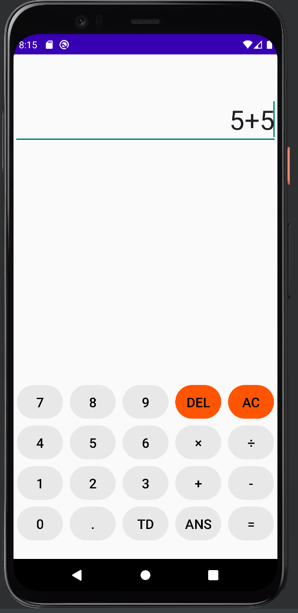

# Android Studio Calculator
## About The Project :blue_book:

I'm currently learning mobile app development using Android Studio. I decided to start by trying to replicate some of the features on my CASIO calculator. Some buttons are currently not implemented but you can still do basic calculations like a simple addition, subtraction, division, and multiplication. 

